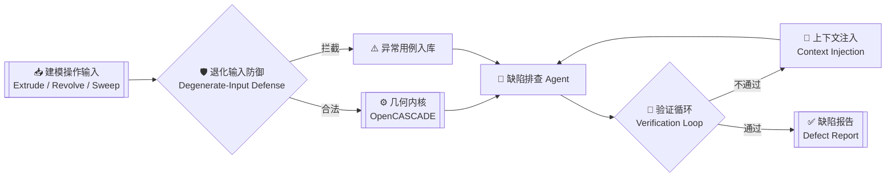

<!-- ============ 样本 3：工程蓝图版 ============ -->
<!-- 最贴合 CAD 工程师身份：图纸标题栏 + Mermaid 架构图（GitHub 原生渲染）+ 工程规格表 -->

| 图号 DWG No. | 名称 TITLE | 材料 MATERIAL | 比例 SCALE | 版本 REV |
| :-: | :-: | :-: | :-: | :-: |
| `LYZ-2026` | AI + CAD 造型内核算法工程师 | C++ / Python / OCCT | 1 : 1 | 🟢 在研 |

## 📐 总装图 · General Assembly

> 在研项目：**几何内核缺陷自动排查 Agent** —— 下面这张架构图由 GitHub 原生渲染，不是贴图：

## 🔩 零件明细表 · Bill of Materials

| 序号 | 零件 PART | 规格 SPEC | 数量 |
| :-: | :-- | :-- | :-: |
| 1 | 🧱 特征建模 Feature Modeling | 拉伸 Extrude · 旋转 Revolve · 扫描 Sweep | ∞ |
| 2 | 🔁 参数化 Parametric | 阵列 Pattern · 镜像 Mirror | ∞ |
| 3 | ✏️ 直接建模 Direct Modeling | 拔模 Draft · 圆角 Fillet | ∞ |
| 4 | 🤖 AI 工程化 | Agent · 验证循环 · 上下文注入 | 1 套 |
| 5 | 🛠️ 工具链 | C++ · Python · CMake · Git · Linux · Qt | 1 套 |

## 🗂️ 部件图 · Sub-assemblies

<table>
  <tr>
    <td width="50%" valign="top">
      <h4><a href="https://github.com/liyongzheng666/Print">🖨️ Print — 部件图 A</a></h4>
      
基于 <b>OpenCASCADE (OCCT)</b> 的 3D 模型查看与打印工具集，浏览器内解析、预览、处理几何。

      
      
    </td>
    <td width="50%" valign="top">
      <h4><a href="https://github.com/liyongzheng666/geometry-engineer-ai-road">📐 geometry-engineer-ai-road — 部件图 B</a></h4>
      
几何算法工程师的 <b>12 周 AI 提效课程</b>：验证循环、退化输入防御、上下文注入。

      
      
    </td>
  </tr>
</table>

## 📏 检验记录 · Inspection Record

  
  

  

  <picture>
    <source media="(prefers-color-scheme: dark)" srcset="https://raw.githubusercontent.com/liyongzheng666/liyongzheng666/output/github-snake-dark.svg" />
    
  </picture>

## 🖋️ 签字栏 · Sign-off

| 设计 DESIGNED | 校核 CHECKED | 批准 APPROVED | 日期 DATE |
| :-: | :-: | :-: | :-: |
| 李永正 | [GitHub](https://github.com/liyongzheng666) | [📧 Email](mailto:zk545791580@gmail.com) | 持续更新 |

⚡ 公差范围内交付 · Build kernels · ship fast · stay curious

